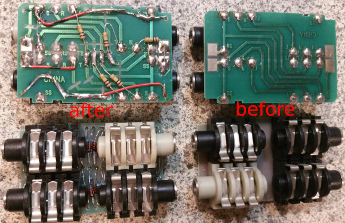
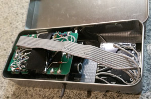
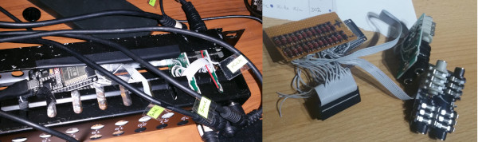

# Edrumulus Project Log

## 11/21/2021 Time to say goodbye, Hilbert...

  The filtered signal currently used for peak detection is a Hilbert filtered signal with
  a moving average low-pass filter applied to it. The initial motivation for this design
  was to reduce the noise and improve the main lobe energy measurement. It turned out that
  it is advantageous to just use the peak value instead of an average. 
  Therefore, we should use an optimized filter which improves the peak detection. To
  reduce the noise floor, a low-pass filter should still be applied. At the same time, some
  high pass filter should be applied to filter out very low frequency noise caused by, e.g,
  the movement of the pad stand after a hit on the pad. Thus, a Butterworth band-pass filter
  with a pass-band of 40 to 400 Hz was chosen. The shorter the pass-band, the longer the filter
  settle time will be. Since the settle time should be as short as possible, it
  is a trade-off between noise reduction and latency. 
  In the following picture, the current Hilbert filter based design is compared to the new
  Butterworth filter design where the peak detection threshold is tweaked for each scenario
  so that no false peaks are detected in the entire signal:
    
  It can be seen that the new Butterworth filter design detects more peaks compared to
  the existing Hilber filter design. 
  Note that the investigation and implementation is currently on a Git side branch. It will
  take some time to finish this work until it is ready to be merged on the Git main branch.

## 10/09/2021 Fixing issues and improving positional sensing
  I am currently heavily changing the Edrumulus code on a Git side branch. I found an issue
  with the moving average filter of the Hilbert filter result and also want to improve the
  positional sensing. As soon as these changes are done, the code will be merged onto the
  main Git branch.

## 10/02/2021 PD-80R investigations
  I just found out that on the PD-80R mesh pad the detected MIDI velocity at the
  edge of the pad is much too small compared to the hit with the same force in the middle of
  the pad. The problem is that there is a moving average of 2 ms applied to the signal which
  is used to find the maximum value. If you play a mesh pad at the edge, the main peak is of
  smaller width compared to the peak if you hit the mesh pad in the middle. Therefore, a lot
  more energy is collected with the long moving average filter for the hit in the middle. To
  fix this issue, the moving average could be shortened to, e.g., 0.5 ms. But if this is
  modified, multiple other problems arise like we have to rise the threshold. This is most
  probably caused by the fact that the longer averaging has filtered away small peaks from
  the ADC noise. Also, the retrigger cancellation does not work as good anymore. 
  To solve the issue, one way would be to use the longer moving average filter for the
  threshold detection and a shorter moving average filter for the MIDI velocity detection.

## 09/28/2021 PD-8 positional sensing does not work
  It turned out that the positional sensing algorithm does not work at all for the
  Roland PD-8 rubber pad. Interestingly, it works quite good for the Yamaha TP-80 rubber pad.
  More investigations are needed to find out the cause of the problem. 
  A detailed view of the curcuit board for the jack sockets which are based on the patchbay is
  shown in the following picture:
   

## 09/19/2021 Some project logs
  - One outstanding serious issue is false triggering in case no pad is played. This may be caused
    by electromagnetic interference like if someone switches a light on or it is caused by the
    microcontroller and its ADC itself.
  - In Edrumulus the start of the Scan Time is defined at the first detected peak. Usually, the
    scan time is defined from the point in time when the input signal crosses the trigger threshold.
    It has shown that if, e.g., the trigger is hit directly, we might get strange effects before the
    main peak so that the signal goes above the threshold earlier than for normal pad hits and as
    a consequence, the scan time would not cover the same amount of the regular peaks as with the
    normal pad hits.
  - For the PD80R, the positional sensing must be improved since sometimes a false first peak is
    detected if the piezo is hit directly with the stick (hot spot).

## 07/17/2021 Adding a cross talk cancellation
  Now an experimental pad cross talk cancellation algorithm is supported in
  Edrumulus. This is useful if pads are attached on the same stand and trigger each other.

## 07/04/2021 Improving ADC spike detection algorithm
  Still too many false detections on the ESP32. The ADC spike detection algorithm
  must be improved. A new algorithm development file "adc_spike_cancellation.m" was created.

## 05/15/2021 Hardware support is stable
  After a lot of tweaking, both boards (ESP32 and Teensy) perform good enough now
  so that I can concentrate on the algorithm development again. On the Teensy, I had to disable
  the "keeper" and average multiple ADC samples to get correct and spike free readings. Since
  the ARM core is so fast, there were no problems running the algorithms in real time. 
  For the ESP32 the situation is different. The CPU speed was the limiting factor for a long time.
  Fortunately, I found out that it is possible to run the ADC processing on one CPU core and
  do the signal processing on a different CPU core. That solved the speed issue. I did not find
  a way to suppress the ADC spikes on the ESP32 but I solved the problem in software with a spike
  cancellation algorithm. This solution is not ideal (especially for low velocity hits the
  performance is degraded) but still good enough.

## 05/09/2021 Teensy 4.0 versus ESP32
  There is a new prototype, now using a Teensy 4.0 developer board:
    
  Difference between ESP32 and Teensy 4.0 with regard to Edrumulus:
  Feature | ESP32 | Teensy 4.0
  --- | --- | ---
  #ADC inputs | 18 | 14
  FPU | yes | yes (better performance than ESP32)
  Speed | 240 MHz dual core | 600 MHz single core
  ADC | 2 ADCs, a lot of spikes | 2 ADCs, less spikes (but still some smaller spikes visible)
  USB MIDI | over serial, needs Hairless MIDI or ttyMidi | shows up as USB MIDI device
  Debugging | either serial debugging or MIDI | MIDI and debugging can be done in parallel
  Cost | ~10 € | ~20 €

## 05/02/2021 Prototype 1 on Youtube
  Here is link to a Youtube video of the new Prototype 1 in action: https://youtu.be/UKeuFm_DDTk
   I was running [Drumgizmo](https://drumgizmo.org) under Linux on my Laptop with the
  [The Aasimonster](https://drumgizmo.org/wiki/doku.php?id=kits:the_aasimonster) drum kit where the
  snare samples were replaced by Tama Artstar snare samples which support positional sensing.

## 05/01/2021 Minimal drumset prototype
  There is another Edrumulus prototype which is a minimal
  drumset with kick/snare/hi-hat:
   

## 04/10/2021 Prototype
  Here is what my current Edrumulus prototype looks like:
   

## 04/04/2021 ADC spikes of the ESP32
  This is how the ESP32 ADC signal looks like:
    
  These spikes seem to be a hardware restriction of the ESP32. I am trying to mitigate this
  effect by implementing a spike suppression algorithm.

## 04/03/2021 Using our own analogRead implementation
  The Edrumulus now implements its own analogRead function so we can use
  the newest arduino-esp32 library version (which is 1.0.6 at present time).

## 04/01/2021 Speed tests
  Some speed tests with 6 pads:
  Everything + adc1_get_raw call: **0.368 ms**, Everything: **0.1162 ms**, Without process sample: **0.077 ms**,
  Without analogRead: **0.0455 ms**. 
  Conclusion: The new ESP32 Arduino Library now [uses the IDF driver](https://github.com/espressif/arduino-esp32/pull/3377)
  which is basically the adc1_get_raw function which is very slow as seen in my speed tests. My speed tests also
  showed that the bottle neck is the analog read.

## 03/24/2021 Measurements of hi-hat controllers
  Measurements of hi-hat controllers:
  **VH-12 controller:** open **14 kOhm**, closed **10 kOhm**, pressed **8 kOhm**,
  **FD-8 controller:**  open **50 kOhm**, closed **0 Ohm**.

## 03/23/2021 Issue with Arduino board manager for ESP32
  I just updated the Ardunio board manager "ESP32 by Espressif Systems" to Version
  1.0.5 and now the code runs much slower on the ESP32 module so that I cannot even run just one
  pad with 8 kHz sampling rate anymore. So I had to revert the board manager version to 1.0.4. I
  hope that with the next board manager update this issue will be fixed and we get back to the
  normal speed on the hardware. For the time being I will stick to version 1.0.4.

## 03/20/2021 Improving retrigger cancellation algorithm
  The retrigger cancellation algorithm is now improved. The decay power is now estimated
  and the decay curve adjusted accordingly. I also bought three used patchbays which have a lot of
  jack sockets which can be used as trigger inputs.
   

## 02/05/2021 Using Drumgizmo
  I am currently evaluating the great [Drumgizmo](https://drumgizmo.org) software
  to be used in conjunction with Edrumulus. I am in contact with the [main developer](https://drumgizmo.org/wiki/doku.php?id=team) and have
  already written some code to [support ALSA MIDI in Drumgizmo](https://linuxmusicians.com/viewtopic.php?f=56&t=22714).
  I am currently trying to run Drumgizmo on a Raspberry Pi zero but I assume that I will
  need at least a Raspberry Pi 4 to get a decent performance.

## 01/24/2021 Rim shot detection done
  Rim shot detection is now ready but does not yet perform as good as the reference
  Roland TD-20 module. Anyway, by just rotating my PD-120 pad so that I hit the rim approximately
  at the position where the jack plug is located, the rim shot detection works much better now
  since the rim shot piezo is also located close to the jack plug.

## 01/19/2021 Rim shot detection development
  Still working on the rim shot detection using the PD-120 pad. It turns out to be very
  difficult to get a reliable rim shot detection. So, it will take some more time to solve this problem.

  The current project plan is to continue working on making the PD-120 triggering as good as possible.
  If possible, I would like to compare the performance of Edrumulus to the TD-20 by capturing the piezo
  signal together with the MIDI output of the TD-20.

  If the PD-120 triggering is ready, I'll start to support other pad types like the PD-80R and the PD-6.
  Then support kick trigger pads like the KD-8. Finally, the hi-hat/crash/ride pads shall be supported.

## 12/22/2020 Testing BLE MIDI
  Just tested BLE MIDI (i.e. MIDI over bluetooth). I could successfully connect to GarageBand
  on an iPhone. Unfortunately, the bluetooth connection caused some interference in the audio input signal
  so that the threshold had to be increased and also we got a lot of false detections on low velocity hits
  at the edge of the pad. So for future hardware designs some shielding should be considered. Also, I started
  looking at the second piezo signal to support rim shot detection.

## 12/20/2020 Support positional sensing on an ESP32
  The positional sensing algorithm is now also ported to the ESP32 micro controller. I have made a
  new Youtube video using the current implementation (Git commit c796369): https://youtu.be/naP-ODXl9Y0

## 12/18/2020 Running initial algorithms on an ESP32
  I have ported the Octave peak detection code to the ESP32 developer board (a DOIT ESP32 DEVKIT V1,
  no positional sensing yet) and connected it via my PC and Hairless MIDI to my Roland TD-20 module so that
  the snare sound was coming out of the TD-20. This time I could test the performance in real-time. The parameters
  were not yet optimized but still, the results were very promising. Without positional sensing, the ESP32 runs at
  about 56 kHz sampling rate when calculating the peak detection algorithm on one pad. Since I only need 8 kHz
  sampling rate (maybe even 4 kHz is sufficient), we have a lot of headroom for the positional sensing algorithm
  or to add rim shot support and support multiple pads.

## 12/13/2020 Initial algorithm tests
  I am very pleased about the current algorithm performance. The algorithm is not yet fine-tuned but
  already performs pretty well. I have created a short Youtube video of the algorithm (Git commit c83743e) to show
  the current performance in action: https://youtu.be/6eQjCD-DFjo

  The following plot shows how the current status of the algorithms performs. At the beginning there are
  some single hits. Then there follows a region with a snare drum roll. After that, there are single hits
  which start from the middle, move to the edge and go back to the middle of the pad where the hits are
  equally strong. As shown by the black markers, the positional sensing seems to work pretty well. Also,
  the peak detection and velocity estimation seems to be pretty good as well.
   

