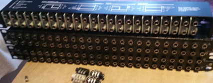
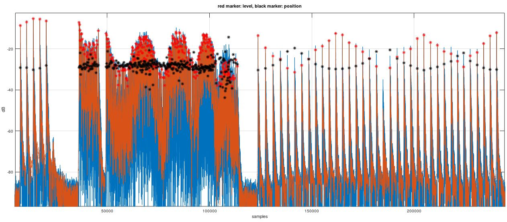

# Edrumulus project log

- (04/01/2021) Some speed tests with 6 pads:
  Everything + adc1_get_raw call: **0.368 ms**, Everything: **0.1162 ms**, Without process sample: **0.077 ms**,
  Without analogRead: **0.0455 ms**. 
  Conclusion: The new ESP32 Arduino Library now [uses the IDF driver](https://github.com/espressif/arduino-esp32/pull/3377)
  which is basically the adc1_get_raw function which is very slow as seen in my speed tests. My speed tests also
  showed that the bottle neck is the analog read.

- (03/24/2021) Measurements of Hi-Hat controllers:
   **VH-12 controller:** open **14 kOhm**, closed **10 kOhm**, pressed **8 kOhm**,
   **FD-8 controller:**  open **50 kOhm**, closed **0 Ohm**.

- (03/23/2021) I just updated the Ardunio board manager "ESP32 by Espressif Systems" to Version
  1.0.5 and now the code runs much slower on the ESP32 module so that I cannot even run just one
  pad with 8 kHz sampling rate anymore. So I had to revert the board manager version to 1.0.4. I
  hope that with the next board manager update this issue will be fixed and we get back to the
  normal speed on the hardware. For the time being I will stick to version 1.0.4.

- (03/20/2021) The retrigger cancellation algorithm is now improved. The decay power is now estimated
  and the decay curve adjusted accordingly. I also bought three used patchbays which have a lot of
  jack sockets which can be used as trigger inputs.
   

- (02/05/2021) I am currently evaluating the great [Drumgizmo](https://drumgizmo.org) software
  to be used in conjunction with Edrumulus. I am in contact with the [main developer](https://drumgizmo.org/wiki/doku.php?id=team) and have
  already written some code to [support ALSA MIDI in Drumgizmo](https://linuxmusicians.com/viewtopic.php?f=56&t=22714).
  I am currently trying to run Drumgizmo on a Raspberry Pi zero but I assume that I will
  need at least a Raspberry Pi 4 to get a decent performance.

- (01/24/2021) Rim shot detection is now ready but does not yet perform as good as the reference
  Roland TD-20 module. Anyway, by just rotating my PD-120 pad so that I hit the rim approximately
  at the position where the jack plug is located, the rim shot detection works much better now
  since the rim shot piezo is also located close to the jack plug.

- (01/19/2021) Still working on the rim shot detection using the PD-120 pad. It turns out to be very
  difficult to get a reliable rim shot detection. So, it will take some more time to solve this problem.

  The current project plan is to continue working on making the PD-120 triggering as good as possible.
  If possible, I would like to compare the performance of Edrumulus to the TD-20 by capturing the piezo
  signal together with the MIDI output of the TD-20.

  If the PD-120 triggering is ready, I'll start to support other pad types like the PD-80R and the PD-6.
  Then support kick trigger pads like the KD-8. Finally, the hi-hat/crash/ride pads shall be supported.

- (12/22/2020) Just tested BLE MIDI (i.e. MIDI over bluetooth). I could successfully connect to GarageBand
  on an iPhone. Unfortunately, the bluetooth connection caused some interference in the audio input signal
  so that the threshold had to be increased and also we got a lot of false detections on low velocity hits
  at the edge of the pad. So for future hardware designs some shielding should be considered. Also, I started
  looking at the second piezo signal to support rim shot detection.

- (12/20/2020) The positional sensing algorithm is now also ported to the ESP32 micro controller. I have made a
  new Youtube video using the current implementation (Git commit c796369): https://youtu.be/naP-ODXl9Y0

- (12/18/2020) I have ported the Octave peak detection code to the ESP32 developer board (a DOIT ESP32 DEVKIT V1,
  no positional sensing yet) and connected it via my PC and Hairless MIDI to my Roland TD-20 module so that
  the snare sound was coming out of the TD-20. This time I could test the performance in real-time. The parameters
  were not yet optimized but still, the results were very promising. Without positional sensing, the ESP32 runs at
  about 56 kHz sampling rate when calculating the peak detection algorithm on one pad. Since I only need 8 kHz
  sampling rate (maybe even 4 kHz is sufficient), we have a lot of headroom for the positional sensing algorithm
  or to add rim shot support and support multiple pads.

- (12/13/2020) I am very pleased about the current algorithm performance. The algorithm is not yet fine-tuned but
  already performs pretty well. I have created a short Youtube video of the algorithm (Git commit c83743e) to show
  the current performance in action: https://youtu.be/6eQjCD-DFjo

  The following plot shows how the current status of the algorithms performs. At the beginning there are
  some single hits. Then there follows a region with a snare drum roll. After that, there are single hits
  which start from the middle, move to the edge and go back to the middle of the pad where the hits are
  equally strong. As shown by the black markers, the positional sensing seems to work pretty well. Also,
  the peak detection and velocity estimation seems to be pretty good as well.
   

# TODO list

- We sometime have double-triggers on hard hits or when the rim is hit. The mask time is already
  at 10 ms. So, the decay handling should be improved to suppress these double-triggers.

  There is also a problem if a press roll with low velocity is played at the edge of the mesh had.
  In this case we sometimes get incorrect detected hits. I just did a test with my TD-20 module by
  setting the velocity of the notes to a fixed value and played a low velocity press roll in the
  middle and at the edge of the mesh had. It seems in the middle of the mesh head it triggers very
  precise. But at the edge of the mesh head you can hear that some hits are not detected. So, it
  seems Roland has optimized their retrigger cancellation algorithm for reducing the detection
  probability of incorrect hits in favor of detecting very low level hits.

- If a rim shot is used, the positional sensing parameters must be adjusted to correctly estimate
  the position.

- The algorithm is optimized for Roland PD-120 pad only. Other pad types should be supported, too.
