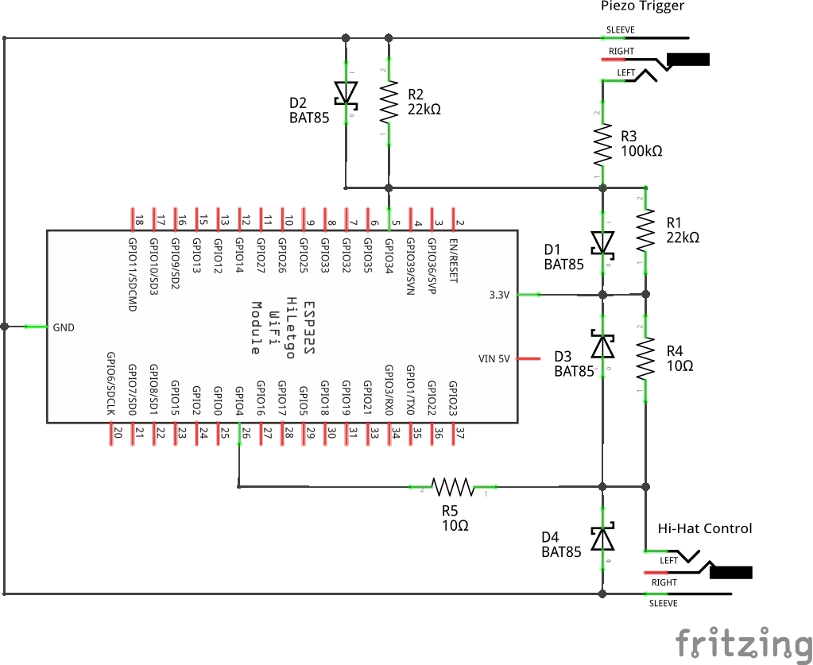

# Edrumulus

The aim of the Edrumulus project is to create a high quality Open Source e-drum trigger module software.

## Project specifications

- The trigger performance shall be similar or better than the Roland TDW-20.

- Overall latency should be as small as possible. The goal is to get a latency < 10 ms.

- Positional sensing shall be supported.

- An ESP32 micro processor shall be used similar to the [open e-drums](https://open-e-drums.com)
  project. It has shown that the ESP32 is powerful enough to fulfill the task of a drum trigger module.

  Many open drum trigger implementations only use one half of the signal (i.e., only the positive
  wave) or use a bridge rectifier to capture the analog signal. Since we want to implement more
  sophisticated algorithms, we want to capture the entire signal without non-linear analog
  preprocessing. Since micro controllers usually only convert analog signals in the range of 0 to 3.3 V,
  we have to move the point of operation in the middle of the voltage range.

  A circuit diagram of my test setup is given in the following picture:
    
  *WARNING* This circuit diagram is only intended for my initial tests. Use it at your own risk.

## Algorithm development

The algorithm research is done using a regular audio card. The drum pad output signal is captured and
the signal processing and algorithm development is then done in Octave. The development is done in
three steps:

1. Create the algorithms using a captured test signal and analyze it as a whole. This is the
   easiest and fastest way to create and improve the algorithms (this is the "playground"). The
   corresponding source file is algorithm/drumtrigger.m.

2. If the algorithm works ok, it is ported to a sample-based processing. The goal is to make the
   Octave code as similar to the C++ micro controller implementation as possible. The corresponding
   source file is algorithm/edrumulus.m.

3. Port the sample-based processing code to C++ and test it in real-time on the hardware. To make
   sure the port was successful, we send test data to the micro controller, query the processed
   signal and compare it in Octave to the reference code.

The algorithms are described in [this document](algorithm/README.md).

## Project log and TODO list

A log of the project can be found in the [change log](ChangeLog.md) file.

## Links

- [open e-drums](https://open-e-drums.com) ([Source code](https://github.com/RyoKosaka/HelloDrum-arduino-Library))

- [eXaDrums](https://hackaday.io/project/9350-exadrums) ([Source code](https://github.com/SpintroniK/libeXaDrums))

- [Arduino Leanordo Midi Drum Kit](https://hoeser-medien.de/2016/11/arduino-leanordo-midi-drum-kit). Uses some re-trigger cancellation. The source code can be found embedded in the web page.

- [An Arduino based standalone drum kit Hackaday](https://hackaday.io/project/171929-an-arduino-based-standalone-drum-kit) ([Source code](https://hackaday.io/project/171929-an-arduino-based-standalone-drum-kit#menu-files)). Generates audio, too.

- [aDrums](https://github.com/josuelopezv/aDrums)

- [ArduinoMidiDrums](https://github.com/evankale/ArduinoMidiDrums)

- [Drum Master](http://drummaster.digitalcave.ca) ([Source code](https://github.com/thebiguno/microcontroller-projects/tree/master/projects/drummaster/rev2/src))

- [Homemade Electronic Drum Kit With Arduino Mega2560](https://www.instructables.com/Homemade-Electronic-Drum-Kit-With-Arduino-Mega2560) ([Source code](https://github.com/Victor2805/Homemade-electronic-drum-kit-with-arduino))

- Forum threads with technical data

  [E-Drum Technik-Thread (für Elektrotechnik- und Informatik-Interessierte)](https://www.drummerforum.de/forum/71415-e-drum-technik-thread-f%C3%BCr-elektrotechnik-und-informatik-interessierte.html)
