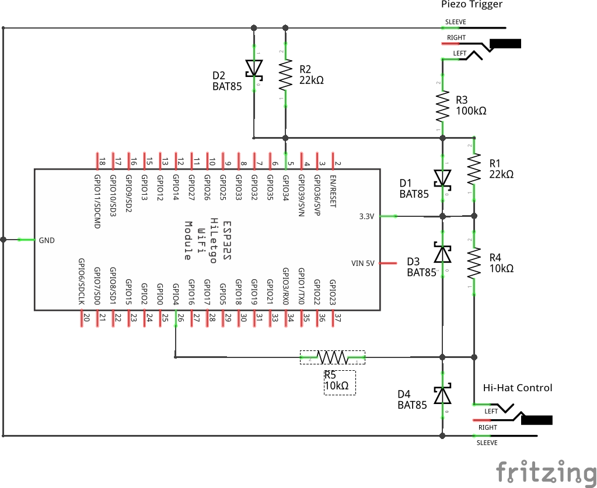

# Edrumulus

**Edrumulus** is a high quality Open Source e-drum trigger module software which runs on a micro processor.

Project requirements:
- The trigger performance shall be similar to the Roland TD-27.
- Overall latency should be as small as possible. The goal is to achieve a latency < 10 ms.
- The required analog front end design shall be as simple as possible using the fewest number of
  parts possible.

## Videos

## News

Find all important updates of the Edrumulus project in the [change log file](doc/ChangeLog.md)
and in the [discussion forums](https://github.com/corrados/edrumulus/discussions). A road map
of the Edrumulus project can be found in the [TODO file](doc/TODO.md).

## Features

- Positional sensing
- Retrigger cancellation
- Rim shot/cymbol choke detection
- Cross talk cancellation
- Clipping compensation
- Supported micro processor developer boards:
  - **ESP32 (dual core) DEVKIT V1 or similar**
  - **Teensy 4.0/4.1**

## Documentation

- [Manual](doc/manual.md)
- [Algorithm](doc/algorithm.md)

## Prototype hardware

We want to capture the entire signal without non-linear analog preprocessing.
Since micro controllers usually only convert analog signals in the range of 0 to 3.3 V,
we have to move the point of operation in the middle of the voltage range.

A circuit diagram of a simplified prototype which only supports a mono piezo pad and
a hi-hat controller input is given in the following picture:
  

The full circuit diagram of Prototype2 is given in [this PDF file](hardware/prototype2/edrumulus.pdf).

*DISCLAIMER* All these circuit diagrams are used for my first prototypes and work fine for me. Use them
at your own risk. In particular the circuits may not work for currently unsupported pieces of hardware.

## Gallery

A gallery of user implementations of Edrumulus prototypes [can be found here](doc/gallery.md).

## Links

- [eXaDrums](https://exadrums.com) ([Hackaday](https://hackaday.io/project/9350-exadrums), [Source code](https://github.com/SpintroniK/libeXaDrums))

- [Drumidy](https://hackaday.io/project/176712-drumidy-electronic-midi-drum-controller) ([Source code](https://github.com/EvgenyD/Drumidy)): Uses a STM32 processor with 18 inputs and supports re-trigger cancellation.

- [open e-drums](https://open-e-drums.com) ([Source code](https://github.com/RyoKosaka/HelloDrum-arduino-Library))

- [Arduino Leanordo Midi Drum Kit](https://hoeser-medien.de/2016/11/arduino-leanordo-midi-drum-kit): Uses some re-trigger cancellation. The source code can be found embedded in the web page.

- [An Arduino based standalone drum kit Hackaday](https://hackaday.io/project/171929-an-arduino-based-standalone-drum-kit) ([Source code](https://hackaday.io/project/171929-an-arduino-based-standalone-drum-kit#menu-files)): Generates audio, too.

- [aDrums](https://github.com/josuelopezv/aDrums)

- [Drum Master](https://github.com/thebiguno/microcontroller-projects/tree/master/projects/drummaster/rev2/src)

- Forum: [How to solve a system of hyperbola equations](https://math.stackexchange.com/questions/3373011/how-to-solve-this-system-of-hyperbola-equations)

- Forum: [E-Drum Technik-Thread (für Elektrotechnik- und Informatik-Interessierte)](https://www.drummerforum.de/forum/71415-e-drum-technik-thread-f%C3%BCr-elektrotechnik-und-informatik-interessierte.html)

