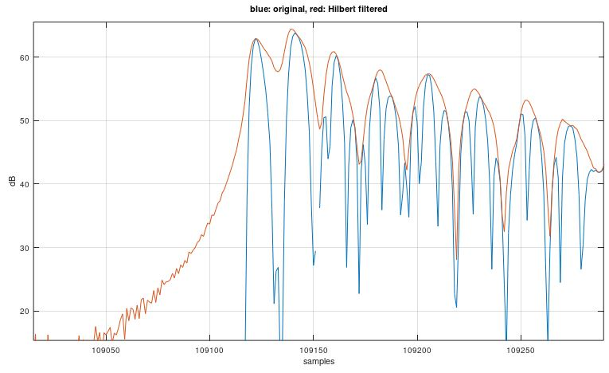
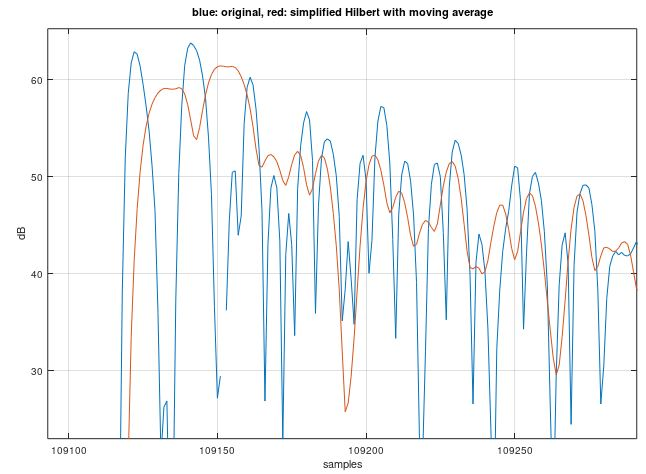
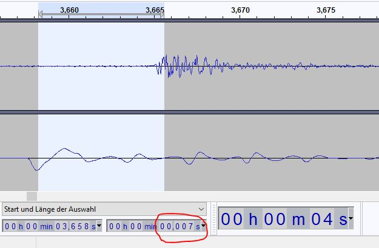

# Drum triggering algorithm

The task to convert a hit on the drum pad with the stick to a MIDI signal consists of mulitple stages.
The first stage is the detection of the position in time of the stick hit. This we call the
__peak detection__. Then we __estimate the velocity of the hit__ using the detected peak. The next
step is to estimate the position of the stick hit on the pad (i.e. if the hit was in the center or
at the edge of the pad). This is called __positional sensing__. Another step is to use the information
of a second piezo sensor to detect if we have a rim shot which leads to a __rim shot detection__. In
this step we can also detect if we have a cross stick situation.

## Peak detection

### Signal filtering

If you calculate the power of the recorded real-valued audio signal, the resulting power curve has
significant power drops caused by the nature of a sinusoidal signal. A filtering can smooth the
curve. As a possible filter we can use a Hilbert transform to convert the real-valued signal in a
complex signal. As a result, the magnitude of that complex signal is much smoother already without
having modified the actual spectrum of the signal (real-valued signals have mirror symmetric spectrum).
This effect is shown in the following picture:
 

As can be seen in the graph, the default Hilbert filter in Octave uses a long impulse response which
would introduce a large delay. To get to a more practical implementation, we use our own Hilbert filter
design which has a very short impulse response. Using that simplified Hilbert filter leads to less
power drop cancellation. To improve the situation, we apply a moving average filter after the simplified
Hilbert filter. This is not only to reduce the power drops but to improve the velocity estimation. The
idea of the velocity estimation is to estimate the energy of the drum stick hit on the mesh head. To
estimate the energy of a signal, it makes sense to integrate the measured powers over a period of time,
which is basically a moving average filter. The resulting trace can be seen on the next picture:
 

### Retrigger cancellation

To improve the peak detection, we can make use of the known decay curve of the trigger pad in use.
So, after successfully detecting a peak, we know that this peak causes a slowly decaying power
curve which has a known shape and we can subtract that known curve from the signal to improve the
detection of the next pad hit.

The problem is that the main peak power compared to the mesh head vibration power greatly depends
on the position of the hit on the pad. I.e. the main peak stands way out of the _noise_ when hitting
the pad in the middle. So, if we use the detection hit velocity for the start point of the decay
cancellation, we subtract too much power in case the hit is in the middle of the pad and we may
subtract too little if the hit is at the edge of the pad.

In the following picture, the effect of the retrigger cancellation algorithm on a press roll signal
example can be seen. The yellow line shows the exponential decay attenuation we apply to the signal
after a hit was detected. The blue trace is the original captured signal and the orange trace is
the captured signal after subtracting the retrigger cancellation:
 

## Positional sensing

If you hit the pad close to the edge, the resulting sound has less low frequencies
and sounds more crisp. So, the idea is to low-pass filter the signal and at the detected peak position we
calculate the power ratio of the low-pass filtered signal with the unfiltered signal. This is then
the metric for the positional sensing.

Further testing showed that it is important to use the very first peak in time for positional sensing. If
a later peak is used, the positional sensing based on the low-pass filtered signal does not yield
good results.

It has shown that the positional sensing metric must be adjusted if a rim shot is used. So, the
rim shot detection information has to be used for the positional sensing, too.

## Rim shot detection

To detect a rim shot, a second piezo sensor is typically mounted at the casing of the pad. So, to
support rim shot detection, we need a second input signal. At this point I want to reference this
[excellent description of piezo sensing](https://github.com/RyoKosaka/HelloDrum-arduino-Library/blob/master/docs/sensing.md)
by [RyoKosaka](https://github.com/RyoKosaka).

Unfortunately, when I tried out different algorithms for rim shot detection I found out that a simple
algorithm as proposed by RyoKosaka did not give me the expected performance. After I found out that
the rim shot detection is not that straightforward, I did some testing with my Roland TDW-20 and I
figured out that even this professional module has its problems with rim shot detection. The
detection results were not perfect either.

The current algorithm design uses a high pass filtered rim piezo signal and the rim shot detection
metric is the ratio between the peak power of the head piezo compared to the peak power of the high
pass filtered rim piezo signal where we search for the rim peak power in a predefined time window.
This window is 5 ms long which will cause an additional trigger delay to the overall algorithm.

# Test signals

To support a new pad type, test data should be recorded. If a second trigger is supported, a
stereo signal sampled at 8 kHz shall be used, otherwise use a monophonic recording. Make sure
that the signal is never clipped, even for the highest velocity hits.

The following hit sequence shall be recorded:

- 5 single hits at medium velocity near the center of the pad
  - intended for estimating the decay curve gradient
- 10 to 20 single hits near the center of the pad varying the hit velocity from lowest velocity
  to highest possible velocity
  - intended for threshold/sensitivity adjustment
- about 10 hits with low velocity starting from left edge of the pad going to the middle and
  back to the edge of the pad
- about 10 hits with high velocity starting from left edge of the pad going to the middle and
  back to the edge of the pad
  - both test signals are intended for positional sensing
- press roll at low velocity near the middle of the pad
- press roll at high velocity near the middle of the pad
- press roll at low velocity near the edge of the pad
- press roll at high velocity near the edge of the pad
- press roll varying velocity from high to low and back to high near the middle of the pad
- press roll varying velocity from high to low and back to high near the edge of the pad
  - the press rolls are for optimizing the parameters for the retrigger cancellation

# Latency between pad hit and audio output of the synthesized drum sound

As given in our project specifications, the overall latency should be as small as possible.
The goal is to get a latency < 10 ms. This overall latency consists of:

Time to

- analog-digital convert the analog pad signal,
- process the digital signal with the trigger detection algorithms (filter delays, etc.),
- transmit the MIDI signal,
- create a digital synthesized drum sound signal from the received MIDI signal,
- digital-analg convert the digital signal to get the final audio signal to be played in the loudspeaker or headphone.

If the trigger detection algorithm runs on a microcontroller or DSP and the analog-to-digital conversion
is done on a per-sample bases (i.e. not based on blocks like on a regular audio interface on a PC), this
delay is negligible.

The delay introduced by the trigger detection algorithms is more critical. E.g. if we filter the digital
signal with a FIR filter, this filter will introduce a delay of half the length of the impulse response
used by the FIR filter. So we are restricted in the length of the impulse response to keep the delay low.
The same thing applies to, e.g., moving average filters or scan times. All this introduces delay which we
want to minimize to get to our goal in the project specifications.

The transmission delay of the MIDI signal depends on the channel. If we use the serial communication channel
over USB to transmit the MIDI signal, the delay should be negligible. But if we, e.g., use the bluetooth
of an ESP32 to transmit the MIDI signal, significant delay (about 10 ms) is introduced by this.

The synthesis and digital-to-analog conversion of the drum audio signal shall not be covered by this
project (at least not right now). So, we can ignore this part for now.

## Comparison of e-drum module latencies

According to https://www.vdrums.com/forum/general/the-lounge/1182869-fastest-lowest-latency-drum-module-available and http://onyx3.com/EDLM, the drum modules have the following measured latencies:

- Roland TD-50\30: **3 ms**    (measured by Chris K)
- Roland TD11\15:  **3 ms**    (measured by Chris K)
- Roland TD15:     **3.15 ms** (measured by 30YearsLater)
- Roland TD12:     **3.60 ms** (measured by 30YearsLater)
- Roland TD-20:    **5.7 ms**  (measured by Chris K)
- Roland TD-4:     **3.8 ms**  (measured by onyx3.com)
- Roland TD-17:    **3.6 ms**  (measured by onyx3.com)
- MIMIC:           **4 ms**    (measured by Chris K)

I measured the latency of my Roland TDW-20 module by using a stereo splitter cable and connected the
trigger output of my PD-120 pad directly to one channel of my sound card input and also to the trigger
input of the TDW-20 module (note that I used the snare input which supports rim shot detection and
positional sensing which may have an influence on the overall TD-20 latency).
Then I connected the analog audio output of the TDW-20 to the other stereo channel of
my sound card and recorded the signal with Audacity. I now measured the latency between the main
peak of the pad trigger to the first peak of the synthesized signal from the TDW-20. As seen in the
screen shot, there is a latency of about **7 ms**:
 

