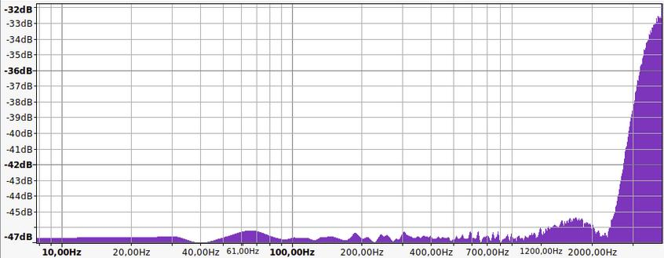
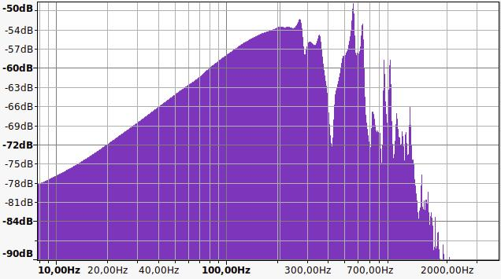
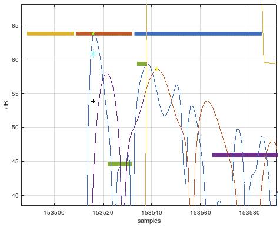
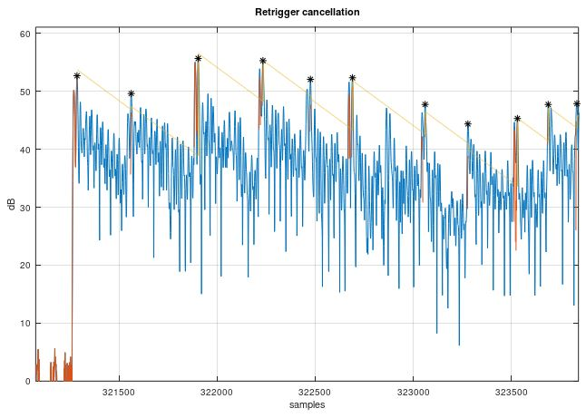
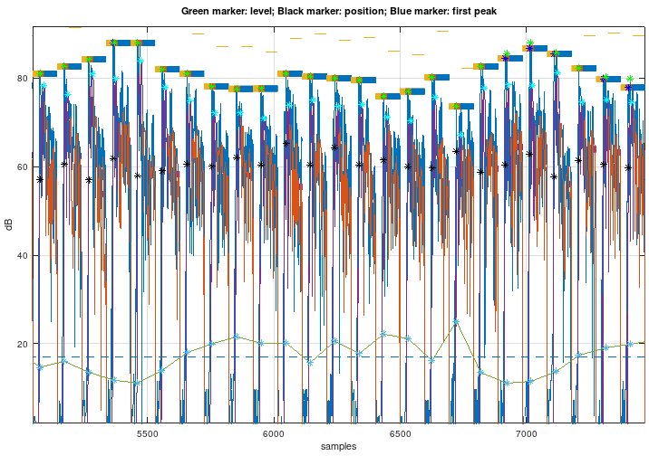
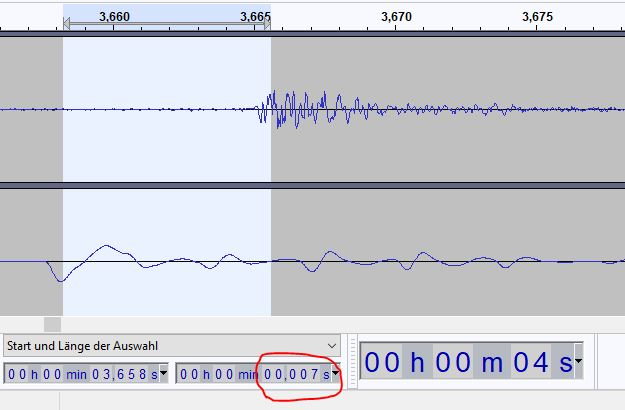

# Drum triggering algorithm

The task to convert a hit on the drum pad with the stick to a MIDI signal consists of multiple stages.
The first stage is the detection of the position in time of the stick hit. This we call the
__peak detection__. Then we __estimate the velocity of the hit__ using the detected peak. The next
step is to estimate the position of the stick hit on the pad (i.e. if the hit was in the center or
at the edge of the pad). This is called __positional sensing__. Another step is to use the information
of a second piezo sensor to detect if we have a rim shot which leads to a __rim shot detection__. In
this step we can also detect if we have a cross stick situation.


## Peak detection

### Signal filtering

The noise of cheap ADCs is usually not equally distributed over the entire frequency spectrum. e.g.,
the Teensy 4.0 noise spectrum looks like the following plot and has high noise energy at the high
frequencies:
<br/>

The spectrum of a piezo signal (in this example using a PD-120 mesh head pad) looks like this:
<br/>

The most energy of that signal is located near 200 Hz. Therefore, to improve the peak detection,
it makes sense to apply a band-pass filter to filter out ADC noise in spectrum parts which are
not used by the pad piezo signal like very low frequencies and high frequencies. Thus,
a band-pass filter is applied to match the useful signal spectrum and filter out the noise.

The pass-band width is a trade-off between noise cancellation and filter delay. As you can see in
the following plot where the blue trace is the original ADC signal and the red trace is the
band-pass filtered signal. Typically, you see three distinct peaks in the red trace which is the
band-pass filtered signal no matter what the original peak looks like:
<br/>

This effect is amplified if the upper cut-off frequency of the band-pass filter is lowered.
It has shown that a good compromise is to use a pass-band range of 40 Hz to 400 Hz.


#### Pre-scan time

Caused by the three peaks of the band-pass filtered signal as described in the last section, it
can happen that the second peak (the middle peak) is higher than the first peak. If a buzz-roll
is played and the time distance between strikes is short, the retrigger cancellation can lead to
the fact that the second peak is above the detection threshold and the first peak is not. This
could lead to the problem that the very first/main peak is not inside the scan time period. To
overcome this problem, we introduce a so-called pre-scan time where we store the ADC signal
in a FIFO and search in a time period right before the scan time for a possible first/main
peak. This is marked by the yellow bar in the above plot which shows the three peaks of the
band-pass filtered signal (The red bar is the scan time and the blue bar is the mask time).


#### Latency of the band-pass filtered signal

The band-pass filter introduces a filter delay which is usually below 2 ms. The good thing is
that this filter delay can be ignored as long as it is shorter than the scan time. This is
because we only use the band-pass filtered signal for the threshold test. For anything
else we use the pure ADC signal which is not delayed. So, we store the original ADC signal
in a FIFO and can therefore start the scan time in the past, i.e., undo the band-pass filter
delay.


### Retrigger cancellation

To improve the peak detection, we can make use of the known decay curve of the trigger pad in use.
After successfully detecting a peak we know that this peak causes a slowly decaying power
curve. It has a known shape which we can subtract from the captured signal to improve the
detection of the next pad hit.

The problem is that the main peak power compared to the mesh head vibration power greatly depends
on the position of the hit on the pad. I.e., the main peak stands way out of the _noise_ when hitting
the pad in the middle. If we use the detection hit velocity for the start point of the decay
cancellation, we subtract too much power in case the hit is in the middle of the pad and we may
subtract too little if the hit is at the edge of the pad.

In the following picture, the effect of the retrigger cancellation algorithm on a press roll
example can be seen. The yellow line shows the exponential decay attenuation we apply to the signal
after a hit was detected. The blue trace is the original captured signal and the orange trace is
the captured signal after applying the retrigger cancellation:
<br/>


## Positional sensing

If you hit the pad close to the edge, the resulting sound has less low frequencies
and sounds more crisp. Thus, the idea is to low-pass filter the signal and at the detected peak position we
calculate the power ratio of the low-pass filtered signal with the unfiltered signal. This is then
the metric for the positional sensing.

The flow diagram of the algorithm is as follows:

```
                   ┌──────────────┐    ┌───────────┐
                   │              │    │           │    positional
ADC signal ───┬───►│ detect first ├───►│ calculate ├───► sensing
              │    │    peak      │    │   metric  │      result
              │    │              │    │           │
              │    └───────┬──────┘    └───────────┘
              │            │                 ▲
              │            │                 │
              │            │                 │
              │            ▼                 │
              │     ┌────────────┐    ┌──────┴───────┐
              │     │            │    │              │
              └────►│  low-pass  ├───►│ detect first │
                    │   filter   │    │    peak      │
                    │            │    │              │
                    └────────────┘    └──────────────┘
```

The impulse response of the low-pass filter is a triangle shape where the length of the triangle
defines the cut-off frequency of the filter and [can be approximated](https://dsp.stackexchange.com/questions/9966/what-is-the-cut-off-frequency-of-a-moving-average-filter)
with $\frac {\sqrt{0.196202 + F_{co}^2}}{F_{co}},$ where $F_{co}$ is the cut-off frequency and N is the length of the impulse response.

Further testing showed that it is important to use the very first peak in time for positional sensing. If
a later peak is used, the positional sensing based on the low-pass filtered signal does not yield
good results.

For positional sensing when a rim shot is played, we use the rim shot detection metric which gives a
good indication of the position:
<br/><br/>
The idea is that if the strike is far away from the center mounted piezo,
the peak in the rim piezo is much higher than that from the center mounted piezo. If the strike is close
to the middle of the pad, the peak of the center mounted piezo is much higher compared to the rim piezo.


### Positional sensing if a rim-shot is played

It has shown that the positional sensing metric must be adjusted if a rim shot is used. Therefore, the
rim shot detection information has to be used for the positional sensing.


## Rim shot detection

To detect a rim shot, a second piezo sensor is typically mounted at the casing of the pad. To
support rim shot detection, we need a second input signal. At this point I want to reference this
[excellent description of piezo sensing](https://github.com/RyoKosaka/HelloDrum-arduino-Library/blob/master/docs/sensing.md)
by [RyoKosaka](https://github.com/RyoKosaka).

Unfortunately, when I tried out different algorithms for rim shot detection I found out that a simple
algorithm as proposed by RyoKosaka did not give me the expected performance. After I found out that
the rim shot detection is not that straightforward, I did some testing with my Roland TDW-20 and I
figured out that even this professional module has its problems with rim shot detection. The
detection results were not perfect either.


# Algorithm development

The algorithms are developed using a regular audio card. The drum pad output signal is captured and
the signal processing and algorithm development is done in Octave. The development runs in three steps:

1. Create the algorithms using a captured test signal and analyze it as a whole. This is the
   easiest and fastest way to create and improve the algorithms (this is the "playground"). The
   corresponding source file is algorithm/drumtrigger.m.

2. If the algorithm works ok, it is ported to a sample-based processing. The goal is to make the
   Octave code as similar to the C++ micro controller implementation as possible. The corresponding
   source file is algorithm/edrumulus.m.

3. Port the sample-based processing code to C++ and test it in real-time on the hardware. To make
   sure the port was successful, we send test data to the micro controller, query the processed
   signal and compare it in Octave to the reference code.


# Test signals

To support a new pad type, test data should be recorded. If a second trigger is supported, a
stereo signal sampled at 8 kHz shall be used, otherwise use a monophonic recording. Make sure
that the signal is never clipped, even for the highest velocity hits.


## Normal test data capture

The following hit sequence shall be recorded:

- 5 single hits at medium velocity near the center of the pad
  - intended for estimating the decay curve gradient
- 10 to 20 single hits near the center of the pad varying the hit velocity from lowest velocity
  to highest possible velocity
  - intended for threshold/sensitivity adjustment
- about 10 hits with low velocity starting from left edge of the pad going to the middle and
  back to the edge of the pad
- about 10 hits with high velocity starting from left edge of the pad going to the middle and
  back to the edge of the pad
  - both test signals are intended for positional sensing
- press roll at low velocity near the middle of the pad
- press roll at high velocity near the middle of the pad
- press roll at low velocity near the edge of the pad
- press roll at high velocity near the edge of the pad
- press roll varying velocity from high to low and back to high near the middle of the pad
- press roll varying velocity from high to low and back to high near the edge of the pad
  - the press rolls are for optimizing the parameters for the retrigger cancellation


## Rim shot test data capture

The rim shot test data capture is especially useful for mesh hat pads which use a rim shot
piezo. The following hit sequence shall be recorded:

- 5 hits at low velocity near the center of the pad
- 5 rim shots at low velocity near the center of the pad
- 5 hits at medium velocity near the center of the pad
- 5 rim shots at medium velocity near the center of the pad
- 5 hits at high velocity near the center of the pad
- 5 rim shots at high velocity near the center of the pad
- 5 hits at low velocity near the edge of the pad
- 5 hits at high velocity near the edge of the pad


# Latency between pad hit and audio output of the synthesized drum sound

As given in our project specifications, the overall latency should be as small as possible.
The goal is to get a latency < 10 ms. This overall latency consists of:

Time to

- analog-digital convert the analog pad signal,
- process the digital signal with the trigger detection algorithms (filter delays, etc.),
- transmit the MIDI signal,
- create a digital synthesized drum sound signal from the received MIDI signal,
- digital-analg convert the digital signal to get the final audio signal to be played in the loudspeaker or headphone.

If the trigger detection algorithm runs on a microcontroller or DSP and the analog-to-digital conversion
is done on a per-sample bases (i.e. not based on blocks like on a regular audio interface on a PC), this
delay is negligible.

The delay introduced by the trigger detection algorithms is more critical. E.g., if we filter the digital
signal with a FIR filter, this filter will introduce a delay of half the length of the impulse response
used by the FIR filter. As a result, we are restricted in the length of the impulse response to keep the delay low.
The same thing applies to, e.g., moving average filters or scan times. All this introduces delay which we
want to minimize to get to our goal in the project specifications.

The transmission delay of the MIDI signal depends on the channel. If we use the serial communication channel
over USB to transmit the MIDI signal, the delay should be negligible. But if we, e.g., use the bluetooth
of an ESP32 to transmit the MIDI signal, significant delay is introduced by this (about 10 ms).

The synthesis and digital-to-analog conversion of the drum audio signal shall not be covered by this
project (at least not right now). So, we can ignore this part for now.


## Comparison of e-drum module latencies

According to https://www.vdrums.com/forum/general/the-lounge/1182869-fastest-lowest-latency-drum-module-available and http://onyx3.com/EDLM, the drum modules have the following measured latencies:

- Roland TD-50\30: **3 ms**    (measured by Chris K)
- Roland TD11\15:  **3 ms**    (measured by Chris K)
- Roland TD15:     **3.15 ms** (measured by 30YearsLater)
- Roland TD12:     **3.60 ms** (measured by 30YearsLater)
- Roland TD-20:    **5.7 ms**  (measured by Chris K)
- Roland TD-4:     **3.8 ms**  (measured by onyx3.com)
- Roland TD-17:    **3.6 ms**  (measured by onyx3.com)
- MIMIC:           **4 ms**    (measured by Chris K)

I measured the latency of my Roland TDW-20 module by using a stereo splitter cable and connected the
trigger output of my PD-120 pad directly to one channel of my sound card input and also to the trigger
input of the TDW-20 module (note that I used the snare input which supports rim shot detection and
positional sensing which may have an influence on the overall TD-20 latency).
Then I connected the analog audio output of the TDW-20 to the other stereo channel of
my sound card and recorded the signal with Audacity. I now measured the latency between the main
peak of the pad trigger to the first peak of the synthesized signal from the TDW-20. As seen in the
screen shot, there is a latency of about **7 ms**:
<br/>

